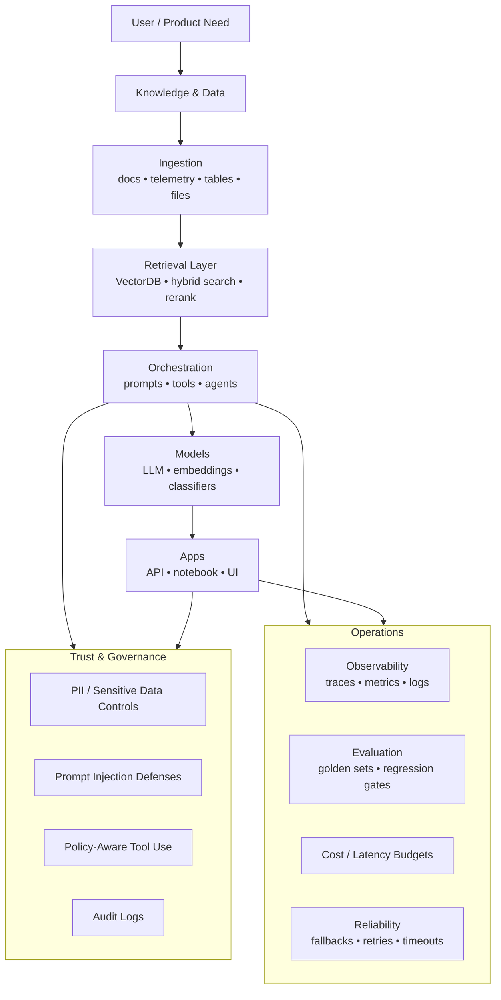
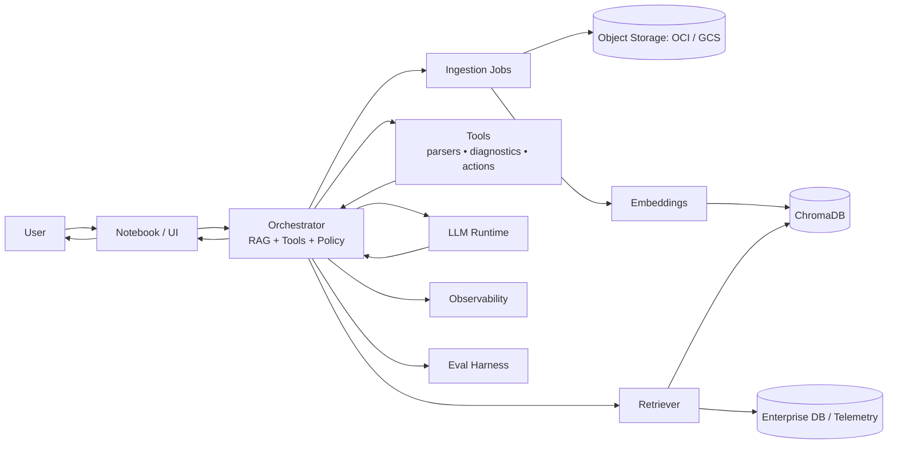

# Keith Gauvin
### AI/ML Systems Architect • Enterprise Architect • Data Platform Engineer 

I design and ship **production-grade AI systems** that combine **LLMs, Retrieval-Augmented Generation (RAG), vector databases (ChromaDB), and cloud infrastructure**—with **evaluation, observability, and governance** as first-class concerns.

<a href="https://www.linkedin.com/in/keith-gauvin-63b2684/"><b>LinkedIn</b></a> •
<a href="mailto:keithggauvin@gmail.com"><b>keithggauvin@gmail.com</b></a> •
<a href="https://github.com/kgauvin603"><b>GitHub</b></a>

---

## TL;DR
- **GenAI Architectures:** RAG, tool-use, multi-agent workflows, structured outputs
- **Data + Platform:** telemetry pipelines, enterprise data access patterns, vector search
- **Delivery:** portable cloud designs (incl. **GCP**) + containerization + CI/CD
- **Workflow:** prototype in **Google Colab / OCI Data Science** → harden into reusable repos and demos

---

## Tech (Badges)

---

## AI Architecture Map (How I build)

---

## Reference System Diagram — RAG + Tools (cloud-portable, GCP included)

---

## Sample Projects (Curated)

---

## What these projects demonstrate

### IADP — Integrated Agent Development Platform
A platform-style approach to building agentic systems:
- agent orchestration patterns
- tool interfaces + constraints
- repeatable workflows and extension points

### AgenticMigrationPlanner
A multi-step planning system designed around:
- decomposition (plan → research → execute)
- structured outputs
- traceability and guardrails

### 23ai-SQL-Analyzer
AI-assisted SQL/PLSQL analysis and correction:
- pattern detection + recommendations
- explainability and repeatable analysis flows
- engineering-friendly output formats

### MyOracleProjects
A curated set of AI/ML and RAG demos:
- end-to-end prototypes
- data + retrieval patterns
- notebook-driven experimentation

### Hugging Face Mirror (kgauvin603_hf_repo)
A practical bridge between:
- spaces/datasets artifacts
- reproducible experimentation
- model/data publishing workflows

### KeithGauvin-AI-ML-Python
Reusable reference code and learning assets:
- examples, utilities, and baseline patterns
- “from notebook to repo” structure

---

## Principles
- **Evaluation-driven iteration** (quality is measured, not guessed)
- **Security-by-design** (least privilege, secrets hygiene, safe tool use)
- **Production realism** (observability, cost/latency budgets, fallbacks)
- **Clear architectures** (diagrams, schemas, structured outputs)

---

## Contact
- **Email:** keithggauvin@gmail.com  
- **LinkedIn:** https://www.linkedin.com/in/keith-gauvin-63b2684/  
- **GitHub:** https://github.com/kgauvin603  

